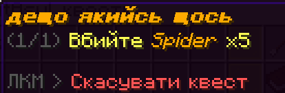
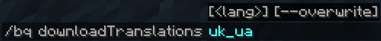
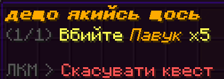

import { Steps } from '@astrojs/starlight/components';
import { LinkButton } from '@astrojs/starlight/components';

The default behavior of BeautyQuests should suit your basic needs. However, you might want to tweak some bits. Fortunately, many parts of BeautyQuests are configurable via its configuration file!

<Steps>
1. Open the `plugins/BeautyQuests/config.yml` file in your text editor.

2. Change the settings you need.
   :::note
   The configuration file is a YAML file. If you are not familiar with this file format, you can read [this guide](https://www.cloudbees.com/blog/yaml-tutorial-everything-you-need-get-started).
   :::
   :::tip[Useful configuration options]
   To begin with, you might want to change the `lang` option from `en_US` to your own language (e.g. `fr_FR` for French). This is what your `config.yml` file should look like:
   ```diff
   # Chosen lang (file name) Available by default: ...
   -lang: en_US
   +lang: fr_FR
   ```
   :::

3. Save the file.

4. Restart your server.
   :::danger
   Do not use the `/reload` command. This will most likely result in weird bugs.
   :::
</Steps>

## Changing Minecraft objects language
A lot of BeautyQuests features rely on vanilla Minecraft objects. For instance, you can ask the players to fetch 10 oak logs or kill 5 spiders. By default, BeautyQuests will display those vanilla objects in the quest description in English. If your server is not in English and you changed BeautyQuests language (using the `lang` configuration option), then the description will be a weird mix of English and another language:



In order to fix that, BeautyQuests has a useful "vanilla translation" feature that uses the Minecraft language files to show the vanilla objects in any language you want.

<Steps>
1. Run `/bq downloadTranslations <lang>` where `lang` is the language you want to download.
   :::caution[Language names]
   The language name is usually in lowercase, e.g. `uk_ua`.

   You can find the list of languages in your Minecraft installation assets, or on an [online viewer](https://mcasset.cloud/26.2/assets/minecraft/lang).
   :::

   

   If the command succeeded, a new JSON file appeared in your `plugins/BeautyQuests` folder (in our case, `uk_ua.json`). It contains the translated names of all Minecraft strings.

1. Open `plugins/BeautyQuests/config.yml` and set the `minecraftTranslationsFile` option to the name of the language you downloaded in the first step.
   ```diff
   -minecraftTranslationsFile: ''
   +minecraftTranslationsFile: 'uk_ua'
   ```

1. Save the file.

1. Restart your server.
</Steps>

Now the Minecraft objects are translated too!

