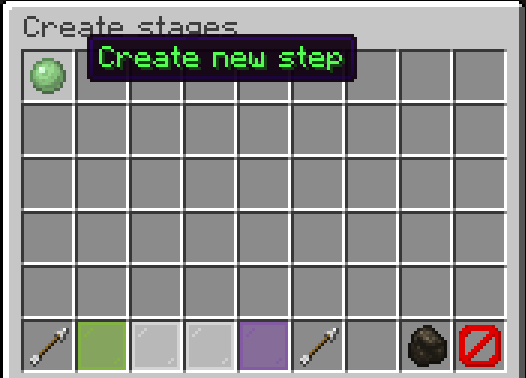
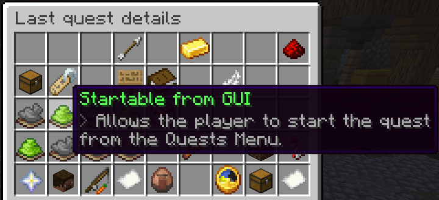
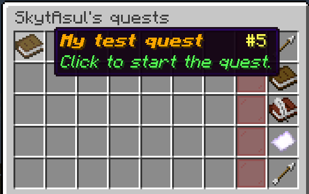

import { Steps } from '@astrojs/starlight/components';
import { LinkButton } from '@astrojs/starlight/components';

## Installation

<Steps>
1.
    Download BeautyQuests from one of the official sources:

    <LinkButton
      href="https://modrinth.com/plugin/beautyquests"
      variant="primary"
      icon="download"
      iconPlacement="start"
    >
      Modrinth
    </LinkButton>
    <LinkButton
      href="https://hangar.papermc.io/SkytAsul/BeautyQuests/"
      variant="secondary"
      icon="download"
      iconPlacement="start"
    >
      Hangar
    </LinkButton>
    <LinkButton
      href="https://github.com/SkytAsul/BeautyQuests/releases"
      variant="secondary"
      icon="download"
      iconPlacement="start"
    >
      GitHub
    </LinkButton>

2. Drop the downloaded `.jar` file in the `plugins` folder of your server.

3. Restart your server.

4. Check that BeautyQuests has been installed correctly by running `/bq version`.

5. Enjoy!
</Steps>

## Create your first quest
<Steps>
1. Run `/bq create` to enter the quest creation editor.

   

2. Add a few simple stages in the first GUI window, such as "break 10 stones" or "kill 3 creepers".

3. Go to the next GUI window by clicking on the diamond item. You will see all available options.

4. Set a name for your quest and turn on the "startable from the menu" option.

   

5. Click on the gold item to finish the quest creation.

6. Open the quests menu by running `/bq` and start your newly created quest!

   
</Steps>